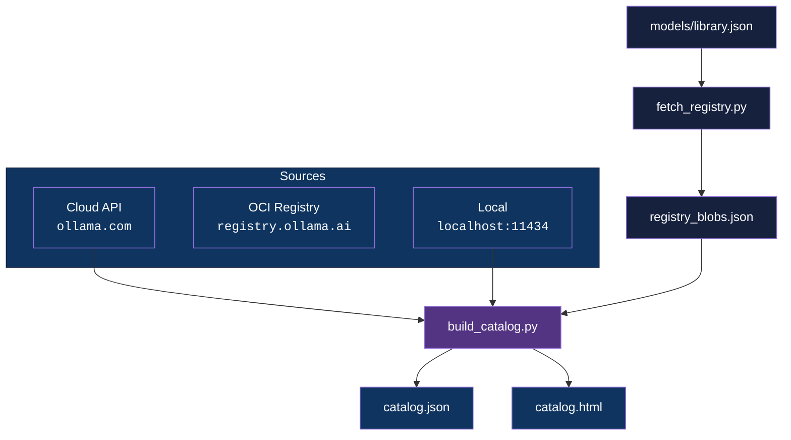

<div align="center">

# Ollama Catalog

[](https://www.python.org/downloads/)
[](LICENSE)

**Complete Ollama model catalog from Cloud API, OCI Registry, and Local — no model downloads required.**

[Getting Started](#getting-started) | [Architecture](#architecture) | [How It Works](#how-it-works) | [Usage](#usage)

</div>

---

## Features

- **Three data sources** — Cloud API (32 curated models), OCI Registry (200+ families, 370+ tags), Local instance
- **No model downloads** — All registry metadata extracted from small blobs (~100 B–5 KB), weights are never fetched
- **Capability detection** — Tools, vision, thinking support identified from template blob patterns
- **Interactive HTML browser** — Filter by source, family, size, capabilities
- **CLI output** — Rich tables with model details

## Architecture



## Getting Started

### Prerequisites

- Python 3.12+
- Ollama Cloud API key (optional — for cloud source)
- Ollama installed locally (optional — for local source)

### Installation

```bash
git clone https://github.com/adityonugrohoid/ollama-catalog.git
cd ollama-catalog

python -m venv .venv
source .venv/bin/activate
pip install -r requirements.txt
```

### Configuration

```bash
cp .env.example .env
```

<details>
<summary>Full configuration reference</summary>

```bash
# Ollama Cloud API (ollama.com) — 32 curated models
OLLAMA_CLOUD_HOST=https://ollama.com
OLLAMA_API_KEY=your-ollama-cloud-key-here

# Ollama Local (localhost) — whatever is pulled
OLLAMA_LOCAL_HOST=http://localhost:11434
```

</details>

## Usage

```bash
# Generate catalog from all sources (cloud + local + registry)
python scripts/build_catalog.py

# Registry only — no Ollama instance needed at all
python scripts/build_catalog.py --source registry

# Cloud + registry (no local Ollama needed)
python scripts/build_catalog.py --source cloud --source registry

# Fetch raw registry blobs (low-level)
python scripts/fetch_registry.py
python scripts/fetch_registry.py --models gemma3:1b,llama3.2:1b
python scripts/fetch_registry.py --smallest
```

## How It Works

### 1. No-Download Registry Probing

Models can be 1–100+ GB. Instead of downloading weights, the OCI registry is probed for small metadata blobs:

| Metadata | Blob Source | Size |
|---|---|---|
| Weight size | Manifest `layers[].size` | 0 (manifest only) |
| Parameter size (e.g. "3.2B") | Config blob → `model_type` | ~100 B |
| Family / architecture | Config blob → `model_family` | ~100 B |
| Quantization | Config blob → `file_type` | ~100 B |
| Capabilities | Template blob → pattern match | ~1–5 KB |
| Runtime params | Params blob | ~100 B |

### 2. Capability Detection

Capabilities are extracted from template blob patterns:

- **Tools**: `{{ .Tools }}`, `[AVAILABLE_TOOLS]`
- **Vision**: `{{ .Images }}`, `image_url`
- **Thinking**: `{{ .ThinkingEnabled }}`, `<think>`
- **Completion**: all models

### 3. Source Priority

When a model appears in multiple sources, cloud/local data takes priority (richer metadata from `/api/show`). Registry entries are marked with `also_available_on` for cross-reference.

## Project Structure

```
ollama-catalog/
├── docs/
│   └── ollama-api-guide.md        # Complete Ollama API reference (894 lines)
├── models/
│   └── library.json               # Model families + tags (197 models, 378 tags)
├── results/
│   ├── catalog.json               # Unified catalog (392 models)
│   ├── registry_blobs.json        # Raw registry metadata (378 entries)
│   └── catalog.html               # Interactive HTML browser
├── scripts/
│   ├── build_catalog.py           # Main catalog generator (875 lines)
│   └── fetch_registry.py          # OCI registry blob fetcher (264 lines)
├── .env.example                   # Configuration template
└── requirements.txt               # httpx, rich, python-dotenv
```

## Roadmap

- [x] Extract and catalog from spatial-llm
- [ ] Clean scripts — remove spatial-llm references
- [ ] Update library.json with latest models
- [ ] Capability columns in HTML dashboard
- [ ] Model diff between snapshots
- [ ] CLI filtering by capabilities and size

See [ROADMAP.md](ROADMAP.md) for full details.

## License

This project is licensed under the [MIT License](LICENSE).

## Author

**Adityo Nugroho** ([@adityonugrohoid](https://github.com/adityonugrohoid))
